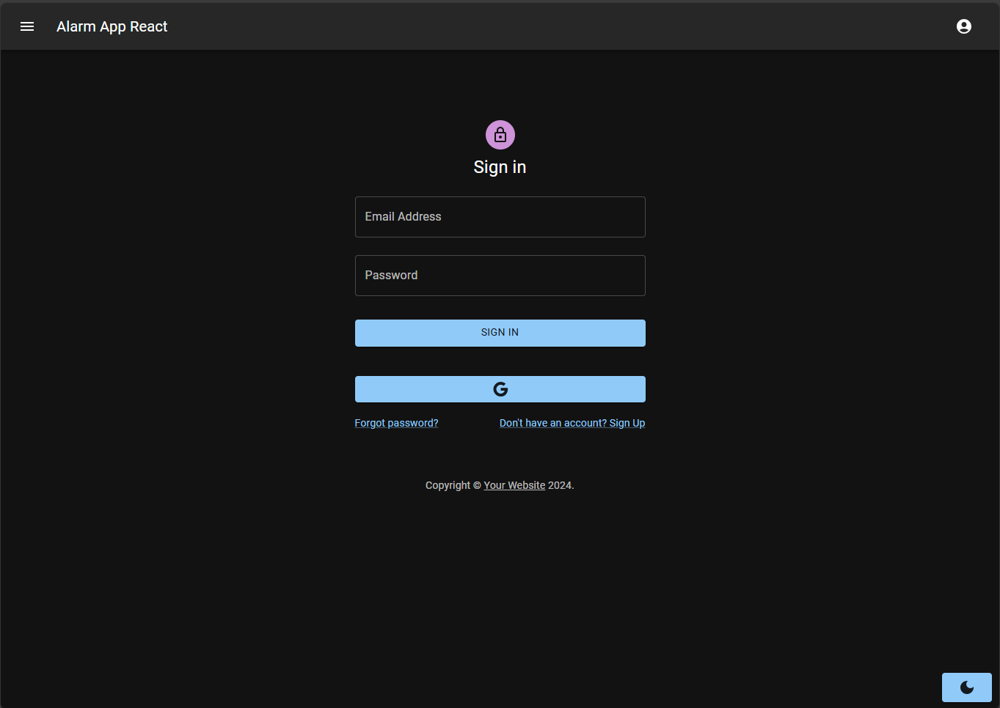
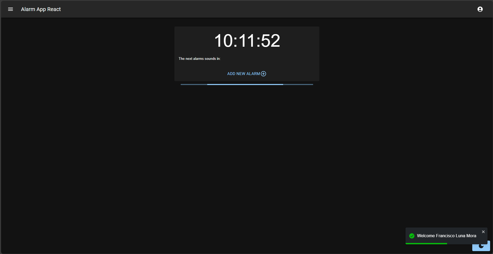
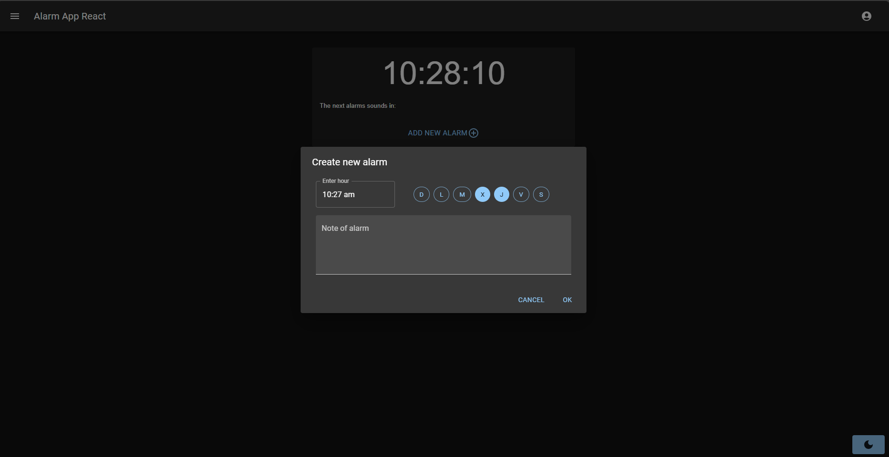
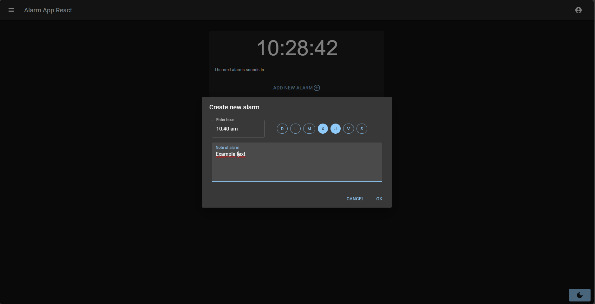

# React App Alarms with TypeScript :alarm_clock:

Alarm app made in react with typescript using the Firebase of Google, use the authentication and the database for storage data

## Screens :camera:

Here they are the some screenshot :screenshot: of screens

### Login :closed_lock_with_key:

### Main Page :watch:

### Create Alarm :clock4:

